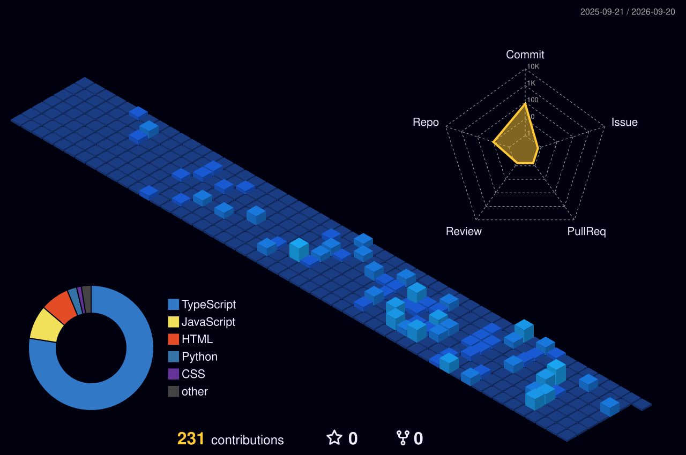

# ⚡ Setup — Cyberpunk Neon Profile

Your profile README lives in a **special repo named exactly like your username**:
`Mr-Bathwal/Mr-Bathwal`. When a repo's name matches your username, its `README.md`
renders on your profile page. That's the whole trick.

---

## 1. Get the files into your profile repo

**If the repo doesn't exist yet**
1. GitHub → **New repository** → name it **`Mr-Bathwal`** (exactly your username).
2. Make it **Public**, tick *"Add a README file"*, create it.
3. Clone it, then copy everything from this folder into it:
   - `README.md`
   - `assets/hero.svg`
   - `.github/workflows/3d-contrib.yml`
   - `.github/workflows/snake.yml`

**If it already exists** — just replace your current `README.md` and add the
`assets/` and `.github/` folders.

```bash
git add .
git commit -m "feat: cyberpunk neon profile redesign"
git push
```

At this point the hero banner, typing text, badges, tech icons, stats, streak,
activity graph and trophies **already work**. Only the snake stays blank until step 2.

---

## 2. Light up the snake (one-time)

The snake is generated by a GitHub Action that commits the image back into your repo.

1. Repo → **Settings → Actions → General → Workflow permissions** →
   select **"Read and write permissions"** → **Save**.
   *(Without this the actions can't push the generated images.)*
2. Repo → **Actions** tab. If prompted, click **"I understand… enable workflows"**.
3. Run it manually the first time: **Actions → "Contribution Snake" → Run workflow**.
4. Give it ~1 minute. Refresh your profile — the snake now glides across your
   contribution graph. It auto-refreshes on a schedule from now on.

> **Optional bonus:** a second workflow, *"3D Contribution Calendar"*, is included
> but **not** used by the default README (kept it clean on purpose). If you ever
> want a rotating 3D calendar, run that workflow too and add
> `` to your README.

---

## 3. Fill in the blanks (30 seconds)

- **Social links** — in `README.md`, the top *Social row* and the *Let's Connect*
  section have `href="#"` placeholders for LinkedIn / X / LeetCode / Instagram /
  Portfolio. Replace each `#` with your real URL. Delete any you don't use.
- **Projects** — the table already lists your five real repos. Add or remove rows
  freely; each row is `emoji · linked name · tech logos · description`.

---

## 4. Optional power-ups (paste when you're ready)

These need a username or token I don't have, so they're **not** in the README by
default (they'd show a broken image). Each one is copy-paste ready — drop it into
the *GitHub Analytics* section once you've filled in your handle.

### 🎧 Spotify — now playing
Deploy [spotify-github-profile](https://github.com/kittinan/spotify-github-profile)
(one-click Vercel), then:
```md

```

### ⌨️ WakaTime — weekly coding breakdown
Sign up at [wakatime.com](https://wakatime.com), add `WAKATIME_API_KEY` as a repo
secret, then add the [waka-readme](https://github.com/athul/waka-readme) action.
It writes a code-time table between `<!--START_SECTION:waka-->` markers.

### 🧩 LeetCode — solved stats card
No token needed — just your LeetCode username:
```md

```

### 📊 Metrics — the "everything" panel (isometric calendar, languages, activity)
Add [lowlighter/metrics](https://github.com/lowlighter/metrics): create a personal
access token as secret `METRICS_TOKEN`, add its workflow, then embed
``. The richest single widget out there.

### 🧊 3D contribution calendar (already wired)
The `3d-contrib.yml` workflow is included. Run it once (Actions tab), then add:
```md

```

---

## Palette — "Aurora" (so future edits stay on-theme)

| Token   | Hex        | Use                        |
|---------|------------|----------------------------|
| Indigo  | `#0F1020`  | every card background      |
| Violet  | `#A78BFA`  | primary accent / titles    |
| Blue    | `#60A5FA`  | secondary accent / icons   |
| Teal    | `#5EEAD4`  | highlights / third accent  |
| Text    | `#C7CCDB`  | body text                  |

---

## Troubleshooting

- **Snake shows a broken image** → the action hasn't run yet, or
  *Workflow permissions* is still read-only. Do step 2.
- **Everything is a broken image** → repo isn't **Public**, or it isn't named
  exactly `Mr-Bathwal`.
- **Stats card is empty** → first render can take a few seconds while the stats
  service caches your data; refresh once.
- **Want private-repo commits counted in stats** → the `count_private=true`
  flag is already set; it only reflects repos the stats service can see.
